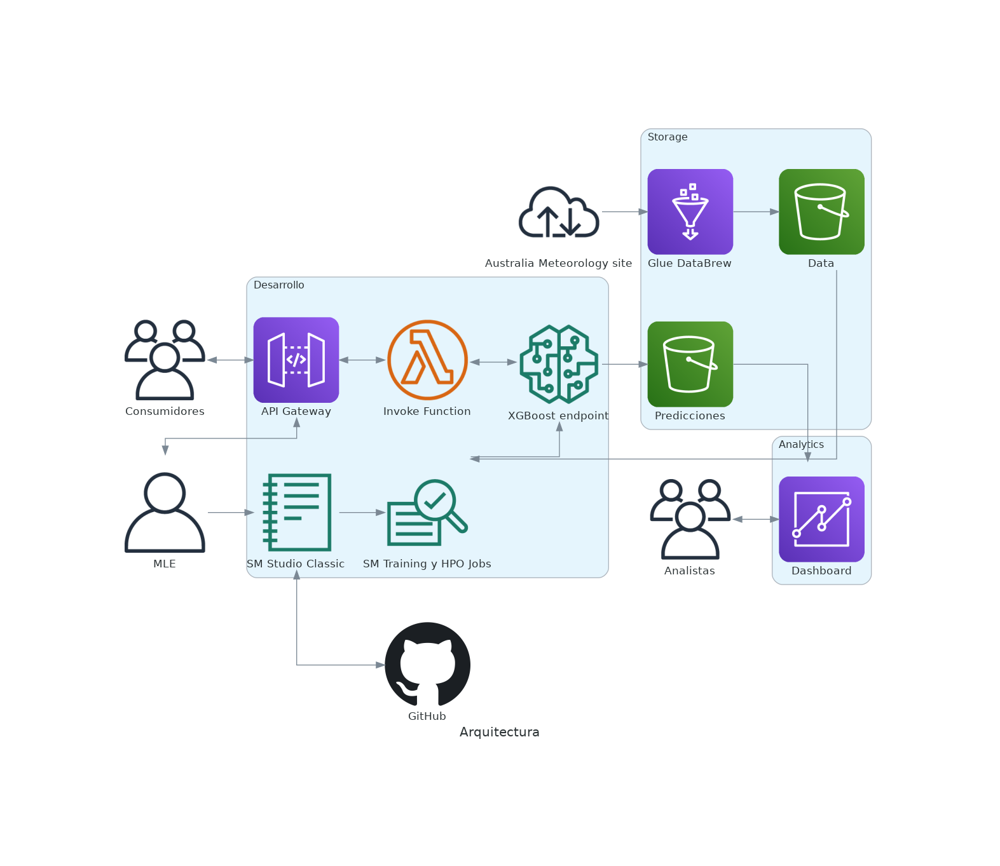

# Machine Learning Engineering en AWS

</img>

Alumno: Scasso, Facundo M.

Resolución del TP para el curso _ITBA MLE en AWS_. Junto a la entrega de este repositorio se adjunta un archivo PDF con el paso a paso de la resolución.

## Dataset

[Link](https://www.kaggle.com/datasets/jsphyg/weather-dataset-rattle-package) a la data utilizada para el proyecto (Copyright Commonwealth of Australia 2010, Bureau of Meteorology).

## Arquitectura

</img>

## Licencia

Todo el código desarrollado se encuentra bajo la licencia **GPL-3.0**. Pueden encontrar su contenido en el archivo `LICENSE`, pero recomendamos leer el resumen de la misma [aquí](https://choosealicense.com/licenses/gpl-3.0/).

Disclaimers: Este es un proyecto personal, para el curso de _ITBA MLE en AWS_ y en categoría de alumno.
